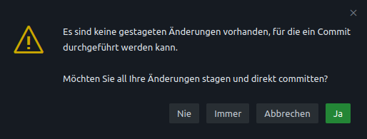

# Bearbeitung von SKOS-Dateien auf GitHub

## 0. Einführung in SKOS

Um sich ein wenig mit den Prinzipien von SKOS (Simple Knowledge Organization System) vertraut zu machen, ist es ratsam, diese [Einführung in SKOS](https://dini-ag-kim.github.io/skos-einfuehrung) zu studieren.

## 1. Anmeldung auf GitHub und Navigieren zum git-Repositorium

* GitHub-Login unter https://github.com/login
* Navigation zum jeweiligen Repo, z.B. [lobid-vocabs](https://github.com/hbz/lobid-vocabs) oder [lbz-vocabs](https://github.com/hbz/lbz-vocabs).

## 2. GitHub Codespaces öffnen

> [!NOTE]  
> GitHub Codespaces ist eine Entwicklungsumgebung, die im Browser läuft. Siehe auch die [offizielle Doku](https://docs.github.com/en/codespaces/developing-in-a-codespace/creating-a-codespace-for-a-repository?tool=vscode#creating-a-codespace-for-a-repository) zum Öffnen eines Codespace.

* auf "<> Code"oben links in der Zeile klicken (falls nicht bereits dort)
* rechts auf "Code" (grün hinterlegt) klicken und "Create codespaces in main/master"

   * Ist die letzte Bearbeitung in einem Codespace nicht allzu lange her, dann kann ein bestehender Codespace ausgewählt werden. Zur Sicherheit sollte dann der Stand in dem Codespace mit dem aktuellen Haupt-Branch abgeglichen werden (siehe Schritt 3).
* Weiterleitung im Browser

## 3. Mit Haupt-Branch synchronisieren 

> [!NOTE]  
> Diese Aktion ist nur nötig, falls der Codespace schon länger existiert und nicht frisch auf Basis des aktuellen Hauptbranchs gebaut wurde. Siehe auch die 

* Eingabe im Terminal (falls ich nicht schon um Hautpbranch bin, was sich in der Footer-Leiste ablesen lässt): `git checkout master` bzw. `git checkout master`
* Eingabe im Terminal: git pull origin master (um den lokalen Stand mit remote abzugleichen)

## 3. Bearbeitung einer Datei im Browser

* links in der Spalte die zu editierende Datei wählen (z.B. `nwbib.ttl` oder `rpb-spatial.ttl`)

* Sodann die Datei im Editor anpassen. Hier ergänze ich beispielhaft zwei neue Top-Level-Konzepte:
   * Der braun/orangene Streifen neben den geänderten Zeilen markiert, dass hier Änderungen vorgenommen wurden.
   * Ein grüner Streifen zeigt an, dass neue Zeilen ergänzt wurden.
  

## 4. Neuen Branch erstellen

> [!NOTE]  
> Da die Änderungen nicht direkt in den Haupt-Branch comittet werden sollen, sondern erst nach Begutachtung durch das hbz, muss nun ein separater Branch für die Änderungen erstellt werden. Siehe auch die [offizielle Doku zum Erstellen und Wechseln von Branches in Codespaces](https://docs.github.com/en/codespaces/developing-in-a-codespace/using-source-control-in-your-codespace#creating-or-switching-branches).

Es gibt zwei Möglichkeiten, den Branch zu erstellen.

Über das UI:

1. Klick auf den aktuellen Branch in der Footer-Leiste und in der Mitte oben öffnet sich ein Dialog mit verschiedenen Optionen.
2. "+ Neuen Branch erstellen auswählen"
3. Branchnamen eingeben, z.B. "addDemoConcept" und Enter drücken
4. Mit Blick in die Footerleiste überprüfen, ob ich tatsächlich auf dem neuen Branch bin.

Über den Terminal:

1. `git switch -c {neuerBranch}` eingeben, z.B. `git switch -c addDemoConcept` (der `-c`-Parameter steht für "create", weil der Branch ja auch erstellt werden muss bevor ich dahin wechsel)
   * Wenn es ein Ticket gibt, ist eine Referenz auf dieses sinnvoll, z.b. `git switch -c addDemoConcept`.
2. Mit Eingabe von `git status` oder durch Blick in die Footerleiste überprüfen, ob ich tatsächlich auf dem neuen Branch bin.

## 5. Turtle validieren

> [!NOTE]  
> Bevor ich die Änderungen committe, sollte ich zumindest prüfen, ob das geschriebene [Turtle](https://www.w3.org/TR/turtle/)-Format valide ist.

1. Ich markiere den gesamten Text mit Strg+a.
2. Kopiere mit Strg+c.
3. Öffne den [Turtle Web Editor](https://felixlohmeier.github.io/turtle-web-editor/).
4. Paste den Inhalt hinein mit Strg+v und drücke "Validate!"
5. Wenn alles gut ist, erscheint "Congrats! Your syntax is correct.", ansonsten muss ich den genannten Fehler korrigieren und erneut validieren.

## 6. Die Änderungen committen

> [!NOTE]
> Prinzipiell kann ein Pull Request beliebig viele Commits umfassen, d.h. bei Anpassungen an verschiedenen Stellen sind ggf. mehrere Commits für die Nachverfolgbarkeit sinnvoll. Die jeweilige Commit-Message sollte die Änderung entsprechend beschreiben. Siehe auch die [offizielle Doku zum Committen von Änderuzngen in Codespaces](https://docs.github.com/en/codespaces/developing-in-a-codespace/using-source-control-in-your-codespace#committing-your-changes).

Es gibt auch wieder zwei Möglichkeiten, um die Änderungen zu committen.

Über das UI:

1. Klick auf das "Quellcodeverwaltung"-Symbol in der linken Navigationsleiste.
2. Eingabe einer Commit-Message und Klick auf "Commit"

3. Auswahl von "Ja" oder "Immer", wenn der Dialog erscheint, der auf nicht-gestagete Änderungen hinweist:

Über den Terminal:

1. Eingabe von `git add .`, womit alle Änderungen in die Staging Area kommen.
2. `git commit` und es öffnet sich eine Datei zum Editieren der Commit-Message
3. Commit Message eingeben, dabei möglichst beachten
   * die Message im Imperativ formulieren (Ticket/Änderungen nennen), Großbuchstabe am Anfang, kein Punkt am Ende
   * nach eine Leerzeile ist ein längerer Kommentar Möglichkeiten
   * siehe auch [hier](https://github.com/metafacture/metafacture-playground/blob/main/CONTRIBUTING.md#commit-messages)

4. Die Datei mit der Commit-Message schießen und der Commit wird gemacht.

## 7. Pull Request eröffnen

> [!NOTE]
> Der Pull Request dient dazu, einen Review-Prozess zu eröffnen, sobal alle gewünschten Änderungen vorgenommen wurden und die Datei valide ist. Siehe auch die [offizielle Doku zum Erstellen eines PR in Codespaces](https://docs.github.com/en/codespaces/developing-in-a-codespace/using-source-control-in-your-codespace#raising-a-pull-request).

1. In der Quellcodeverwaltung auf das "PR Öffnen" Icon  klicken.
2. Einen Titel für den Pull Request eingeben und "Create" klicken.
3. Im folgenden Dialog "Branch veröffentlichen" bzw. "Branch immer veröffentlichen" klicken. (Der Branch wird dann im eigentlichen GitHub-Repo angelegt, denn dies geschieht nicht automatisch, wenn ein branch in Codespaces erstellt wird.)

## 8. Pull Request zuweisen

1. Den Pull Request öffnen, entweder durch Klick auf den entsprechenden Link in Codespaces oder durch ansteuern des PR über die `/pulls`-Liste des jewiligen Repos, z.B. [https://github.com/hbz/lobid-vocabs/pulls](https://github.com/hbz/lobid-vocabs/pulls) oder [https://github.com/hbz/lbz-vocabs/pulls](https://github.com/hbz/lbz-vocabs/pulls)
2. Den PR einer Person im hbz (meist Adrian Pohl/acka47) rechts unter "Reviewers" und "Assignees" zuweisen.

## 9. Review

* hbz-Mitarbeiter:innen begutachten den PR, ergänzen ggf. Anmerkungen und Änderungswünsche oder committen selbst noch zusätzliche Änderungen.
* Sollten Änderungen nötig sein, gibt es ein entsprechendes Review und die Person, die den PR geöffnet hat, wird für die Anpassungen assignt.

## 10. Im Review gewünschte Änderungen umsetzen

Dafür gibt es ggf. zwei Möglichkeiten:

1. Wenn Änderungen bereits vom Reviewer vorgeschlagen wurden, reicht ein Klick auf "Commit suggestion" bzw. "Add suggestion to batch", wenn es mehrere Vorschläge sind.
2. Alternativ kann ich auch einen Codespace öffnen in diesem Branch und dort die Anpassungen vornehmen.

## 11. Änderungen committen und um erneutes Review bitten

Habe ich die gewünschten Änderungen vorgenommen, dann committe ich sie (siehe Schritt 6 oben), erwünsche im PR ein erneutes Review und weise den PR dem Reviewer erneut zu.
